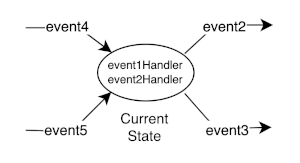
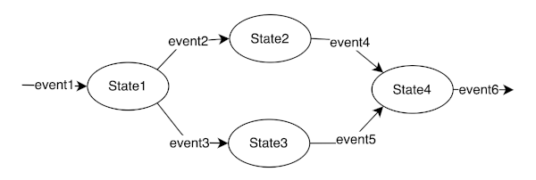
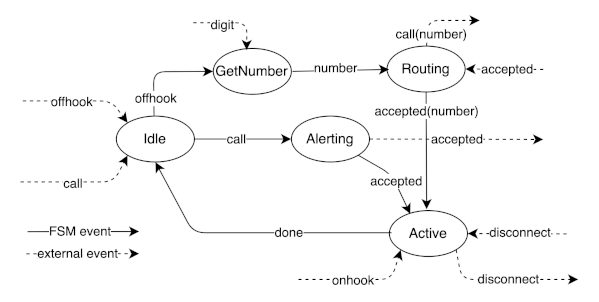
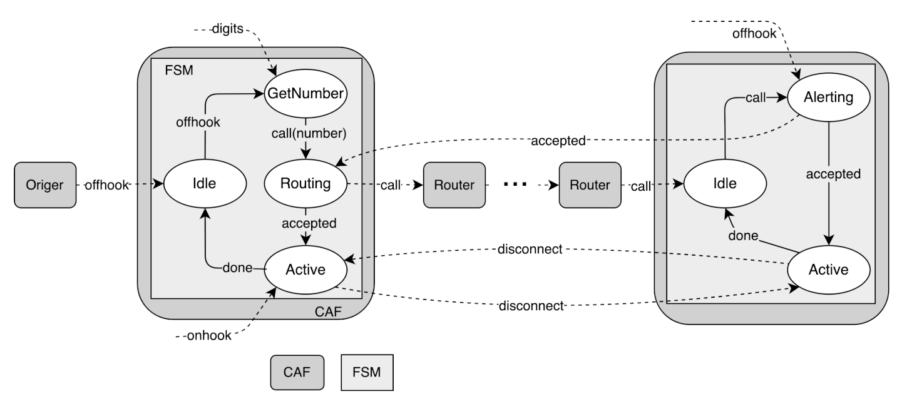

# JS-FSM

JS-FSM is a JavaScript class for the creation of finite state machines (FSM). It features a declarative method for defining an FSM that is verified upon FSM creation. A FSM defintion consists of a set of of states, a set of events that cause transitions from state to state and an initial state.

An FSM state consists of one or more handlers for input events. Each handler generates an output event that drives the FSM to its next state based on transition rules.



Here is a diagram of a simple FSM with its FSM definition.



```
fsmDef = {
  initState: 'state1',

  states: {
    State1: {
      transitions: {event2: 'State2', event3: 'State3'},
      eventHandlers: {
        event1(fsm) {
          if(/* event1 processing outcome is event2 */) return fsm.event.event2;
          if(/* event1 processing outcome is event3 */) return fsm.event.event3;
        }
      }
    },

    State2: {
      transitions: {event4: 'State4},
      eventHandlers: {
        event2(fsm) {
          // Logic to handle event2
          return fsm.event.event4;
        }
      }
    },

    State3: {
      transitions: {event5: 'State5'},
      eventHandlers: {
        event3() {
          // Logic to handle event3
          return fsm.event.event5;
        }
      }
    },

    State4: {
      transitions: {event6: ...},
      eventHandlers: {
        event4() {
          // Logic to handle event4
          return fsm.event.event6;
        },

        event5() {
          // Logic to handle event5
          return fsm.event.event6;
        }
      }
    }
  }
}
```

Below is an example of an FSM for a telephone call. 



A call has originating and terminating ends, each with it's own path through the state machine. Notice that FSM events pass between states but are stimulated by external events. There are also external events exchanged between originating and terminating FSMs. While these external events are not part of the call FSM per se, they are essential to an accurate model of a call.

Support for these external events and simultaneous coordinated FSM operation is provided by the [JS-CAF Github repo](https://github.com/boblund/js-caf) which implements a model of communicating, asynchronous functions. The figure below illustrates a more complete call model using JS-CAF. This model is implemented in the file CallFsmChan.mjs.



# Class FSM

## FSM(def\<Object\>[, options\<Object\>])\<FSM\>

Creates a FSM instance based on ```def``` FSM definition. ```def``` is validated as follows:

- ```def.initState``` is a valid state
- All states are reachable from initState given the defined transitions.
- Each transition has a corresponding eventHandler and vice versa.
- An FSM instance property is created with the key ```events``` and value that is an enumeration of all events in ```def```. Use of this enumeration is preferred to using the event string name as it will catch misspelling errors.

The ```options``` object can have the following properties:
- ```log: <Boolean>``` indicates whether FSM state transisitons are written to STDOUT.
- ```name: <String>``` optional fsm instance name.
- ```args: <Object>``` whose keys and values are added to the fsm instance to be used by the ```eventHandlers``` defined in ```def```.

```
const fsm1 = new FSM(fsmDef, {log: true, args{handlerArg1: 'a string'}});
```

## FSM.addEvent(event\<FSM.events.name\> | [event\<FSM.events.name\>, arg1\<Object\>, ...])\<undefined\>

Appends the event to the the FSM instance event queue. The event is either a value from the events enumeration or an array whose first entry is a value from the events enumeration and the remaining values are event arguments to be used by the corresponding event handler.

```
fsm1.addEvent(fsm1.events.init);
```

## FSM.moreEvents()\<Boolean\>

Returns ```true``` if there are events in the event queue and false otherwise.

```
while(fsm1.moreEvents()){...}
```

## FSM.next()\<Promise\>

- Takes the event from the head of the event queue
- Execute the corresponding event handler for the current fsm state
- Updates the current state based on the transition associated with the event
- Returns a Promise that resolves to the name\<String\> of the new current state upon completion of the event handler

```
switch(await fsm.next()) {
	case 'state':
	...
}
```

# License

Software license: Creative Commons Attribution-NonCommercial 4.0 International

**THIS SOFTWARE COMES WITHOUT ANY WARRANTY, TO THE EXTENT PERMITTED BY APPLICABLE LAW.**
